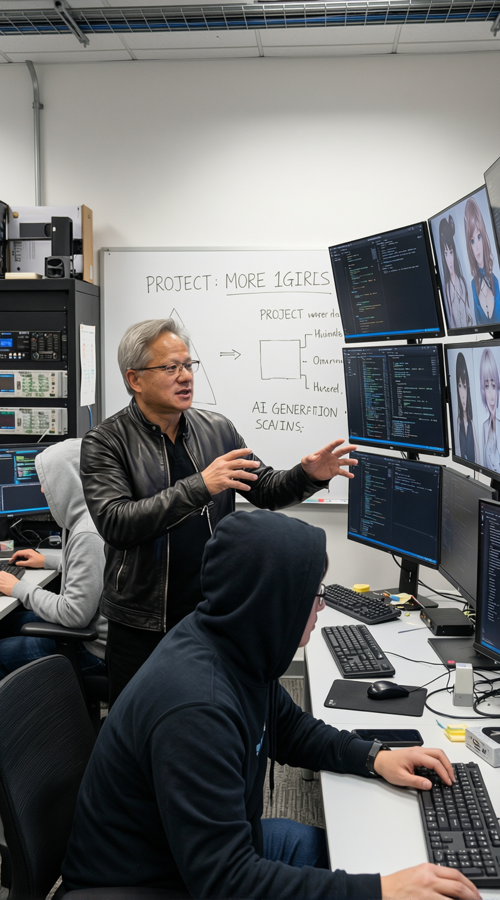

# SynthID-Bypass

**Disclaimer:** This project is intended for educational and AI safety research purposes only. The tools and techniques described herein should not be used for malicious purposes, to circumvent copyright, or to misrepresent the origin of digital content. This proof of concept is presented as-is and without warranty.

**Try it 100% free on Discord: [https://discord.gg/M7Gpr4tTP9](https://discord.gg/M7Gpr4tTP9)**

**Learn More: [https://synthidbypass.com](https://synthidbypass.com)**

---

## 1. Overview

This repository contains a proof-of-concept exploration into the robustness of Google's SynthID [2], a digital watermarking technology integrated into Nano Banana Pro and related Google image systems to help identify synthetic media.

The current release is **V2**, a single ComfyUI workflow kept directly at the repository root. V2 replaces the earlier split between general, portrait, and GGUF workflow variants. The previous release is preserved in the [`V1/`](V1/) archive.

At a high level, the bypass still follows the same core hypothesis as the original release: if the watermark lives in low-level image noise, then a carefully constrained diffusion reconstruction can keep the composition while discarding the watermark-carrying pixels.

## 2. What's New in V2

- **One workflow instead of multiple branches.** V2 is centered on [`Synthid-Bypass-v2.0.json`](Synthid-Bypass-v2.0.json), which consolidates the main path and the face restoration path into one graph.
- **Resolution-aware denoise.** A bundled custom node computes the base denoise from image resolution so the workflow scales more predictably across different input sizes.
- **Custom face detail pass.** V2 ships with a custom node pack, [`custom_nodes/Comfyui-SynthidBypass/`](custom_nodes/Comfyui-SynthidBypass/), that adds a model-swap face detailer with adaptive denoise controls, keeping the renoised faces virtually 1:1 with the originals.
- **Qwen-based base reconstruction.** The main redraw pass uses Qwen Image GGUF models, a Qwen Image Lightning LoRA, and a Qwen DiffSynth Canny controlnet for stronger structure retention.
- **Stricter face segmentation.** V2 combines Ultralytics face detection, MediaPipe face mesh, SAM refinement, SEGS conversion, and a dedicated paste-back stage to preserve facial structure while still shifting pixels enough to break detection.

## 3. Repository Layout

| Path | Purpose |
| --- | --- |
| [`Synthid-Bypass-v2.0.json`](Synthid-Bypass-v2.0.json) | Current workflow release. |
| [`comparison/before/`](comparison/before/) | Place new v2 input images here. |
| [`comparison/after/`](comparison/after/) | Place new v2 processed outputs here. |
| [`workflow_screenshots/`](workflow_screenshots/) | Place fresh screenshots of the v2 graph here. |
| [`V1/`](V1/) | Archived v1 workflows, screenshots, and comparison assets. |
| [`synthid_analysis/`](synthid_analysis/) | Analysis images showing the watermark pattern and discovery process. |
| [`custom_nodes/Comfyui-SynthidBypass/`](custom_nodes/Comfyui-SynthidBypass/) | Bundled custom node pack used by v2. |

## 4. V2 Workflow

The v2 release lives in [`Synthid-Bypass-v2.0.json`](Synthid-Bypass-v2.0.json). Internally, it combines two model paths:

- A **Qwen Image** path for the global redraw, using `qwen-image-2512-Q4_K_M.gguf`, a Qwen image VAE, a Qwen VL GGUF text encoder, a Qwen Image Lightning LoRA, and a Qwen DiffSynth Canny controlnet.
- A **Z-Image Turbo** path for targeted face cleanup, using `z_image_turbo-Q4_K_M.gguf`, `ae.safetensors`, a GGUF Qwen 3.4B text encoder, and a custom face detailer node.

### V2 pipeline summary

1. **Input normalization and adaptive denoise**  
   The workflow loads the source image, rescales where needed, and computes a denoise target with the `Synthid-Bypass-AdaptiveDenoise` node based on input resolution.

2. **Global redraw pass**  
   A single low-denoise `KSampler` redraws the image using the Qwen model path while a Canny edge map is fed into `QwenImageDiffsynthControlnet` to lock the composition.

3. **Strict face segmentation**  
   V2 detects faces with Ultralytics, converts face regions into SEGS masks, and also uses MediaPipe face mesh plus a SAM-assisted fallback path to get cleaner face boundaries.

4. **Adaptive face reconstruction**  
   The bundled `Synthid-Bypass-Facedetailer` node swaps to the Z-Image Turbo model path for face-only cleanup. It supports adaptive denoise scaling so larger detected faces can receive stronger detail repair without overprocessing small faces.

5. **Composite and save**  
   The updated SEGS regions are pasted back onto the main image and the final output is written with `SaveImage`.

### V2 comparison examples

Current v2 proof images live under [`comparison/before/`](comparison/before/) and [`comparison/after/`](comparison/after/).

#### Example 12

| Original | Processed |
| --- | --- |
|  |  |

#### Example 10

| Original | Processed |
| --- | --- |
|  |  |

Additional workflow screenshots can be added under [`workflow_screenshots/`](workflow_screenshots/).

## 5. Analysis: Visualizing the SynthID Pattern

The original insight that led to this bypass came from a simple question: what does SynthID actually look like?

### Visualizing the invisible

To reveal the watermark, I took a blank black image and asked Nano Banana Pro to remake it exactly:

I then increased the exposure, brilliance, highlights, and shadows while lowering contrast. That amplified the subtle pixel-level differences enough to make the watermark pattern visible.

| Watermark Pattern 1 | Watermark Pattern 2 |
| --- | --- |
|  |  |

An important observation was that the watermark pattern is not deterministic. Regenerating the same prompt produces a different pattern each time, which suggests the watermark is not fixed per prompt.

### From visualization to bypass

This led to the core hypothesis behind both v1 and v2: if the watermark is just a layer of image noise, it should be possible to remove it by re-processing the image through a diffusion model while keeping the source composition as tightly constrained as possible.

The key ingredients are:

1. **Low-denoise regeneration** to repaint the image while replacing low-level noise.
2. **Structural guidance** with edge-based control so the redraw follows the source composition.
3. **Targeted face repair** so high-salience human details survive the redraw.

That combination remains the foundation of the project, even though v2 now packages it as a single workflow with a more deliberate face-specific path.

## 6. V1 Archive

The original multi-workflow release has been preserved under [`V1/`](V1/). That archive includes:

- Archived workflows in [`V1/workflows/`](V1/workflows/)
- Archived before/after comparison images in [`V1/comparison/`](V1/comparison/)
- Archived workflow screenshots in [`V1/workflow_screenshots/`](V1/workflow_screenshots/)

This keeps the historical proof set available without mixing legacy assets into the root v2 release.

## 7. Setup & Usage

To run v2, you need a working ComfyUI install plus the required models and custom nodes.

### Installation flow

1. Install a recent version of [ComfyUI](https://github.com/comfyanonymous/ComfyUI).
2. Install the required external custom node repos listed below.
3. Copy the bundled [`custom_nodes/Comfyui-SynthidBypass/`](custom_nodes/Comfyui-SynthidBypass/) folder into your `ComfyUI/custom_nodes/` directory. It is intentionally packaged in the same folder shape ComfyUI users expect from a standalone custom node repo: `README.md`, `__init__.py`, Python module(s), and `requirements.txt`.
4. Download the required models into the exact ComfyUI model directories listed in the resources section.
5. Drag [`Synthid-Bypass-v2.0.json`](Synthid-Bypass-v2.0.json) onto your ComfyUI canvas.
6. Set the `Load Image` node to your source image and run the graph.

### Notes

- V2 is **GGUF-first**. The workflow expects GGUF loaders for both model and CLIP paths.
- The current v2 face detail path uses the `res_2s` sampler and `bong_tangent` scheduler, which come from the `RES4LYF` custom node pack.
- Higher-resolution images may require a stronger adaptive level and/or a slightly higher denoise ceiling.

## 8. Resources

### Required v2 custom nodes

| Custom node | Purpose in v2 | Link |
| --- | --- | --- |
| Bundled `Comfyui-SynthidBypass` | Custom `Synthid-Bypass-Facedetailer` and `Synthid-Bypass-AdaptiveDenoise` nodes | [`custom_nodes/Comfyui-SynthidBypass/`](custom_nodes/Comfyui-SynthidBypass/) |
| ComfyUI-GGUF | GGUF UNet and CLIP loaders | [GitHub](https://github.com/city96/ComfyUI-GGUF) |
| ComfyUI Impact Pack | Detection, SEGS tooling, paste-back, and related face utilities | [GitHub](https://github.com/ltdrdata/ComfyUI-Impact-Pack) |
| rgthree-comfy | Power LoRA loader and image comparer nodes | [GitHub](https://github.com/rgthree/rgthree-comfy) |
| comfyui_controlnet_aux | Canny and MediaPipe preprocessors | [GitHub](https://github.com/Fannovel16/comfyui_controlnet_aux) |
| ComfyUI-KJNodes | Image resize helpers used in v2 | [GitHub](https://github.com/kijai/ComfyUI-KJNodes) |
| ComfyUI-Inpaint-CropAndStitch | Crop/stitch support for face-region processing | [GitHub](https://github.com/lquesada/ComfyUI-Inpaint-CropAndStitch) |
| RES4LYF | `res_2s` sampler and `bong_tangent` scheduler used in the face detail path | [GitHub](https://github.com/ClownsharkBatwing/RES4LYF) |

### Legacy v1 custom nodes

These are retained for the archived v1 workflows in [`V1/workflows/`](V1/workflows/):

- [ComfyUI-DyPE](https://github.com/wildminder/ComfyUI-DyPE)
- [Masquerade Nodes](https://github.com/BadCafeCode/masquerade-nodes-comfyui)
- [SeedVR2 VideoUpscaler Nodes](https://github.com/numz/ComfyUI-SeedVR2_VideoUpscaler)

### V2 model download links

Place each file in the matching ComfyUI directory:

| Model file | Directory | Download link |
| --- | --- | --- |
| `qwen-image-2512-Q4_K_M.gguf` | `models/diffusion_models/` | [Hugging Face](https://huggingface.co/unsloth/Qwen-Image-2512-GGUF/resolve/main/qwen-image-2512-Q4_K_M.gguf) |
| `Qwen2.5-VL-7B-Instruct-Q4_K_M.gguf` | `models/clip/` | [Hugging Face](https://huggingface.co/unsloth/Qwen2.5-VL-7B-Instruct-GGUF/resolve/main/Qwen2.5-VL-7B-Instruct-Q4_K_M.gguf) |
| `qwen_image_vae.safetensors` | `models/vae/` | [Hugging Face](https://huggingface.co/Comfy-Org/Qwen-Image_ComfyUI/resolve/main/split_files/vae/qwen_image_vae.safetensors) |
| `qwen_image_canny_diffsynth_controlnet.safetensors` | `models/diffusion_model_patches/` | [Hugging Face](https://huggingface.co/Comfy-Org/Qwen-Image-DiffSynth-ControlNets/resolve/main/split_files/model_patches/qwen_image_canny_diffsynth_controlnet.safetensors) |
| `Qwen-Image-2512-Lightning-4steps-V1.0-fp32.safetensors` | `models/loras/` | [Hugging Face](https://huggingface.co/lightx2v/Qwen-Image-2512-Lightning/resolve/main/Qwen-Image-2512-Lightning-4steps-V1.0-fp32.safetensors) |
| `z_image_turbo-Q4_K_M.gguf` | `models/diffusion_models/` | [Hugging Face](https://huggingface.co/jayn7/Z-Image-Turbo-GGUF/resolve/main/z_image_turbo-Q4_K_M.gguf) |
| `Qwen_3_4b-imatrix-IQ4_XS.gguf` | `models/clip/` | [Hugging Face](https://huggingface.co/worstplayer/Z-Image_Qwen_3_4b_text_encoder_GGUF/resolve/main/Qwen_3_4b-imatrix-IQ4_XS.gguf) |
| `ae.safetensors` | `models/vae/` | [Hugging Face](https://huggingface.co/Comfy-Org/Z-Image-ComfyUI/resolve/main/split_files/vae/ae.safetensors) |
| `yolov8n-face.pt` | `models/ultralytics/bbox/` | [Hugging Face](https://huggingface.co/Bingsu/adetailer/resolve/main/face_yolov8n.pt) |
| `sam_vit_b_01ec64.pth` | `models/sams/` | [Meta AI](https://dl.fbaipublicfiles.com/segment_anything/sam_vit_b_01ec64.pth) |

## 9. Limitations

- This remains a research workflow, not a one-click consumer product.
- V2 still requires a capable GPU, ComfyUI familiarity, and several external node packs.
- Very high-resolution images may need stronger adaptive settings or adjusted denoise ranges.
- Like v1, the process can introduce artifacts, especially in fine textures or text-heavy regions.

## 10. Related Work & References

This project builds on existing research into diffusion-based watermarking and diffusion-based reconstruction attacks. The core idea of using controlled diffusion to remove low-level watermark signals is aligned with the broader literature on the fragility of pixel-space watermarks [1].

1. Hu, Y., et al. (2024). *Stable signature is unstable: Removing image watermark from diffusion models*. arXiv preprint arXiv:2405.07145. https://arxiv.org/abs/2405.07145
2. Google DeepMind. (2023). *SynthID*. https://deepmind.google/models/synthid/

## 11. Ethical Use

This project is released in the spirit of open and responsible AI safety research. The goal is to help researchers understand the limits of current watermarking systems so more robust approaches can be built.

If you develop a defense that defeats these workflows, please open an issue or pull request and share the results.
